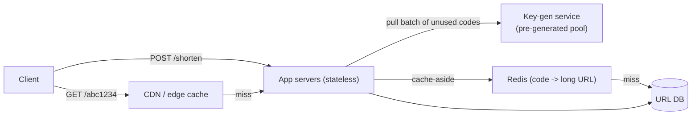

# SD-01 · URL Shortener

> **bit.ly — key generation strategies, read-heavy caching**  
> **Core challenge:** Generate short, unique codes at write time, and serve redirects with near-zero latency at a 100:1+ read:write ratio.

*Reference solution (from the System Design Interview Playbook). For a timed mock, run `/study SD-1`; `/save-session` appends your own notes at the bottom.*

## Requirements & key numbers

- 100M new URLs/month, ~40 writes/sec average
- 100:1 read:write ratio -> ~4,000 redirects/sec average
- ~3TB total storage over 5 years — doesn't force sharding on size alone
- Base62, 7-character codes -> 3.5 trillion combinations, plenty of headroom

## Architecture

## Deep dive

### Key generation — 3 options

- **Hash the URL** (MD5, first 7 chars) — simple but collision-prone, needs check-and-retry on every write
- **Base62-encode an auto-increment ID** — no collisions, but a centralized counter becomes a write bottleneck and reintroduces the sharded auto-increment problem
- **Pre-generated key pool (recommended)** — a separate service generates unused codes ahead of time; app servers pull batches into memory -> zero DB calls, zero collisions on the hot write path

### Read-heavy caching

- Cache-aside: check Redis first, hit DB only on a miss
- Long TTL (or none, rely on LRU) — URLs almost never change, so staleness risk is near zero
- Hot-key protection: a viral link can spike to 100K req/sec on one key — mitigate with cache read replicas + a very-short-TTL local in-memory cache on each app server in front of Redis

### Redirect type

- Use **302 (temporary), not 301** — 301s get cached permanently by browsers, breaking analytics and the ability to change the destination or track clicks

## Trade-offs & bottlenecks at scale

> **Bottom line:** Handles today's scale via caching alone. At 10x scale, single-region latency for distant users breaks first — fix with geo-distributed edge caching (CDN) for the redirect path, since redirects are simple, cacheable, and don't need strong consistency.

## 30-second recall

| | |
|---|---|
| **Requirements twist** | Read:write is ~100:1 — optimise the redirect path, not the create path. |
| **Key design choice** | Pre-generated key pool so the write path never touches the DB for a code. |
| **Main bottleneck (at 10x)** | Single-region redirect latency for global users. |
| **The trade-off they push on** | 302 vs 301 (analytics/control vs one fewer hop); cache staleness vs origin load. |

## My notes (from study sessions)

_Nothing yet. Run `/study SD-1` for a mock round, then `/save-session`._
