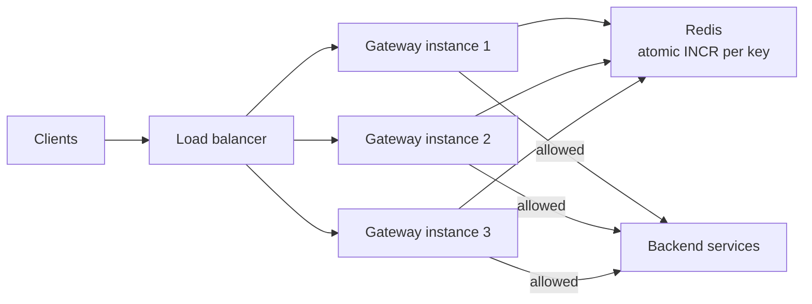

# SD-02 · Rate Limiter

> **token bucket vs sliding window, distributed rate limiting across servers**  
> **Core challenge:** Enforce a shared limit correctly when many stateless app servers sit behind a load balancer — a local in-memory counter silently multiplies the effective limit by the server count.

*Reference solution (from the System Design Interview Playbook). For a timed mock, run `/study SD-2`; `/save-session` appends your own notes at the bottom.*

## Requirements & key numbers

- Limit per API key (e.g. 1000 req/hour), soft precision acceptable
- Must add minimal latency — sits in the critical path of every request
- Multiple gateway instances must all enforce the SAME global limit

## Architecture

## Deep dive

### Token bucket vs sliding window

- **Token bucket** — bucket refills at a fixed rate, each request consumes a token; allows bursts up to bucket size, matches real traffic well (recommended default)
- **Sliding window counter** — weights previous + current window by overlap; smoother, fixes the fixed-window boundary flaw, slightly more computation
- **Fixed window (reject this)** — up to 2x the limit can slip through right at a window boundary

### The real challenge — shared state across servers

- A local counter per server means the true limit becomes N x server_count
- Fix: externalise the counter to a shared store (Redis) that every gateway instance checks

### The race condition

- Separate GET-then-SET isn't atomic — two servers read the same count before either writes back, letting an extra request through
- Fix is an **atomic operation**, not a different algorithm: `INCR` + `EXPIRE` on first hit

### Failure handling

- **Fail open** (allow traffic) with a circuit breaker if Redis is unreachable — a brief window of unlimited traffic is safer than a full outage caused by the limiter itself

## Trade-offs & bottlenecks at scale

> **Bottom line:** At 10x scale, Redis itself can become the bottleneck — shard rate-limit keys across multiple Redis instances by client_id, since each client's limit is independent and needs no cross-client coordination.

## 30-second recall

| | |
|---|---|
| **Requirements twist** | Many stateless gateways must share ONE global limit. |
| **Key design choice** | Externalised atomic counter in Redis (INCR), token bucket algorithm. |
| **Main bottleneck (at 10x)** | Redis throughput -> shard keys by client_id. |
| **The trade-off they push on** | Fail open vs fail closed; precision vs latency. |

## My notes (from study sessions)

_Nothing yet. Run `/study SD-2` for a mock round, then `/save-session`._
