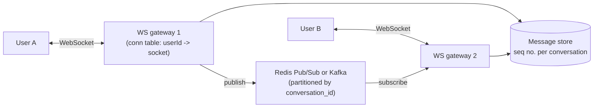

# SD-03 · Chat Application

> **WhatsApp/Slack — WebSockets, message ordering, delivery guarantees**  
> **Core challenge:** Deliver messages in real time with correct ordering, even though sender and recipient may be connected to different servers and may briefly go offline.

*Reference solution (from the System Design Interview Playbook). For a timed mock, run `/study SD-3`; `/save-session` appends your own notes at the bottom.*

## Requirements & key numbers

- Real-time delivery expected — HTTP polling is too slow/wasteful
- Messages must arrive in the order they were sent, per conversation
- Must handle offline recipients — messages queued for delivery on reconnect

## Architecture

## Deep dive

### WebSockets, not polling

- A WebSocket keeps a persistent, bidirectional connection open — the server pushes messages instantly instead of the client repeatedly asking 'anything new?'
- Each app server maintains a table of which user IDs are connected to it

### Message ordering

- Partition by **conversation_id, not globally** — ordering only needs to hold within a conversation, a much easier problem
- Assign a monotonically increasing sequence number per conversation (or use Kafka partitioned by conversation_id)

### Delivery guarantees

- **At-least-once** + idempotency (client-generated message ID) so a retried send doesn't duplicate
- Offline recipients: persist to the message store immediately; on reconnect the client fetches everything after its last-seen sequence number
- Read receipts / delivery status: a separate, lower-priority event stream, not blocking the core send path

### Routing a message to the right server

- If sender and recipient are on different gateways, the sending server publishes to a shared broker (Redis pub/sub or Kafka); the recipient's server subscribes and pushes down its own socket

## Trade-offs & bottlenecks at scale

> **Bottom line:** The WebSocket connection table is inherently stateful — a rare, deliberate exception to the 'always stateless' rule, and exactly why a shared broker between gateway instances is required to route messages across servers.

## 30-second recall

| | |
|---|---|
| **Requirements twist** | Sender and recipient may be on different servers, and may be offline. |
| **Key design choice** | Persistent WebSockets + per-conversation sequence numbers + shared broker for cross-gateway routing. |
| **Main bottleneck (at 10x)** | Stateful connection tables; broker fan-out. |
| **The trade-off they push on** | Stateful gateways (needed) vs stateless ideal; at-least-once + idempotency vs exactly-once. |

## My notes (from study sessions)

_Nothing yet. Run `/study SD-3` for a mock round, then `/save-session`._
