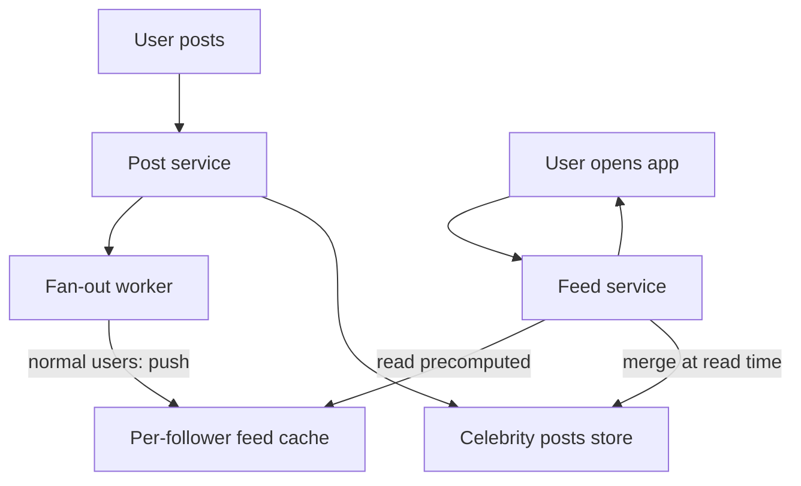

# SD-04 · News Feed

> **Instagram/Twitter/Facebook — fan-out-on-write vs fan-out-on-read**  
> **Core challenge:** Serve a personalized, reverse-chronological (or ranked) feed fast, without either a write storm from high-follower accounts or expensive computation on every feed load.

*Reference solution (from the System Design Interview Playbook). For a timed mock, run `/study SD-4`; `/save-session` appends your own notes at the bottom.*

## Requirements & key numbers

- Read-heavy: users open their feed far more often than they post
- Some accounts have millions of followers — a single post can trigger a huge fan-out
- Feed load latency should feel instant (well under a second)

## Architecture

## Deep dive

### Fan-out-on-write (push model)

- On post, immediately push it into every follower's precomputed feed cache
- Reads become trivial — just read the precomputed list
- Breaks down for celebrities: a 10M-follower post triggers 10M writes at once

### Fan-out-on-read (pull model)

- Feed computed on demand: pull recent posts from everyone the user follows, merge, rank
- No write storm, ever
- Every feed load does more computation — expensive if done naively at read time

### The real answer: hybrid

- Fan-out-on-write for normal users (the vast majority)
- Fan-out-on-read for celebrities/high-follower accounts — merged in at read time instead of pushed everywhere

## Trade-offs & bottlenecks at scale

> **Bottom line:** A genuine 'it depends' answer — interviewers specifically want to hear you name the hybrid rather than pick one extreme. Most real systems (Twitter, Instagram) use exactly this split.

## 30-second recall

| | |
|---|---|
| **Requirements twist** | Read-heavy, but a few accounts have millions of followers. |
| **Key design choice** | Hybrid: push for normal users, pull/merge-at-read for celebrities. |
| **Main bottleneck (at 10x)** | Write storm on celebrity posts (push) vs read-time compute (pull). |
| **The trade-off they push on** | Precompute (fast reads, write amplification) vs compute-on-read (cheap writes, slow reads). |

## My notes (from study sessions)

_Nothing yet. Run `/study SD-4` for a mock round, then `/save-session`._
