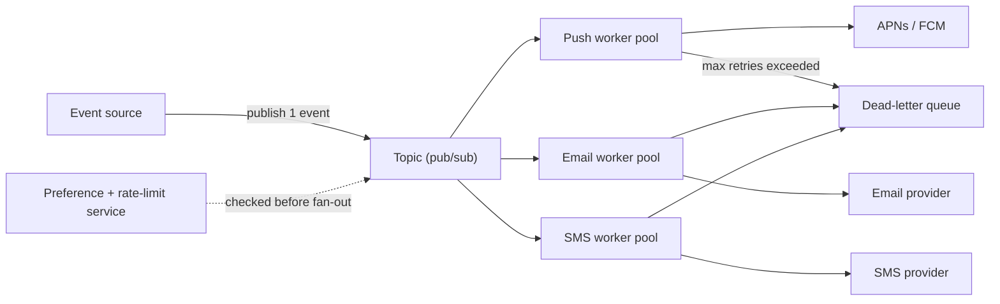

# SD-05 · Notification System

> **pub/sub fan-out, multi-channel delivery, retry / dead-letter handling**  
> **Core challenge:** One event (e.g. 'order shipped') needs to reach multiple independent channels — push, email, SMS — reliably, without one slow channel blocking the others.

*Reference solution (from the System Design Interview Playbook). For a timed mock, run `/study SD-5`; `/save-session` appends your own notes at the bottom.*

## Requirements & key numbers

- Multiple channels per event: push, email, SMS, in-app
- Must not spam a user — needs per-user rate limiting
- Failed deliveries (expired push token, bounced email) must not be silently dropped

## Architecture

## Deep dive

### Pub/sub fan-out

- The event source publishes ONE event to a topic; independent workers for each channel subscribe and process in parallel
- Many independent systems react to the same event without depending on each other's uptime or speed

### Multi-channel delivery

- Each channel is its own worker pool — a slow email provider doesn't delay push (bulkhead pattern)
- User notification preferences are checked before fan-out, not duplicated in every worker

### Retry & dead-letter queue

- Retry with **exponential backoff + jitter** for transient failures
- After max retries, move to a **dead-letter queue** for inspection — never retry forever or silently drop
- Rate limit per user so a burst of 20 events doesn't fire 20 pushes in a minute — batch or debounce

## Trade-offs & bottlenecks at scale

> **Bottom line:** The single most important decision is decoupling via pub/sub rather than the event source calling each channel synchronously — that's what lets you add a new channel (e.g. WhatsApp) later without touching the event source at all.

## 30-second recall

| | |
|---|---|
| **Requirements twist** | One event -> many channels, each with different reliability and speed. |
| **Key design choice** | Pub/sub fan-out; one worker pool per channel; DLQ for failures. |
| **Main bottleneck (at 10x)** | A slow/failing provider; user notification spam. |
| **The trade-off they push on** | Async decoupling (extensible, eventually delivered) vs synchronous calls (simple, tightly coupled). |

## My notes (from study sessions)

_Nothing yet. Run `/study SD-5` for a mock round, then `/save-session`._
