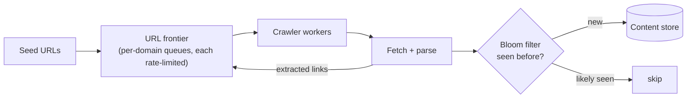

# SD-06 · Web Crawler

> **BFS traversal at scale, dedup, politeness / per-domain rate-limiting**  
> **Core challenge:** Crawl billions of pages without hammering any single domain, without re-crawling the same URL endlessly, while distributing work across many crawler machines.

*Reference solution (from the System Design Interview Playbook). For a timed mock, run `/study SD-6`; `/save-session` appends your own notes at the bottom.*

## Requirements & key numbers

- Billions of URLs, breadth-first traversal from seed URLs
- Must respect robots.txt and avoid overwhelming any one domain
- Must not re-crawl a URL already processed

## Architecture

## Deep dive

### BFS via a URL frontier

- True in-memory BFS is impossible at this scale — a distributed queue (the 'frontier') holds URLs to crawl
- Workers pull, crawl, extract links, push them back — level-by-level BFS behaviour emerges naturally

### Politeness — per-domain rate limiting

- Without it a crawler could send thousands of req/sec to one small site and effectively DDoS it
- Frontier is partitioned into per-domain queues, each with its own rate limit and a mandatory delay between requests to the same host (reuses rate-limiter concepts)

### Deduplication

- **Bloom filter** — space-efficient probabilistic 'have I likely seen this URL?'; false positives (skip a new URL) acceptable, false negatives never happen
- **Content hashing** — hash page content to skip near-duplicate pages served under different URLs

## Trade-offs & bottlenecks at scale

> **Bottom line:** At 10x scale the frontier itself needs sharding (e.g. by domain hash) across multiple queue partitions — otherwise the frontier's own throughput becomes the ceiling on total crawl speed.

## 30-second recall

| | |
|---|---|
| **Requirements twist** | Billions of pages, but must be polite to each individual domain. |
| **Key design choice** | Distributed URL frontier with per-domain rate-limited queues; Bloom filter for dedup. |
| **Main bottleneck (at 10x)** | Frontier throughput -> shard by domain hash. |
| **The trade-off they push on** | Bloom filter space savings vs rare false-positive skips; politeness delay vs crawl speed. |

## My notes (from study sessions)

_Nothing yet. Run `/study SD-6` for a mock round, then `/save-session`._
