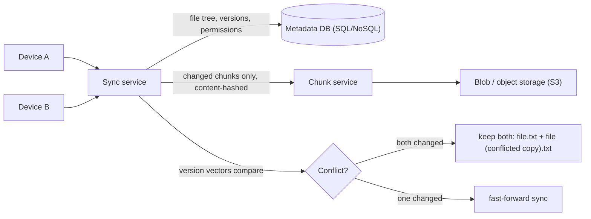

# SD-07 · File Storage / Sharing Service

> **Dropbox/Google Drive — chunking, sync conflict resolution, metadata vs blob split**  
> **Core challenge:** Sync large files efficiently across devices, resolve conflicting edits, and separate cheap-to-query metadata from expensive-to-store file content.

*Reference solution (from the System Design Interview Playbook). For a timed mock, run `/study SD-7`; `/save-session` appends your own notes at the bottom.*

## Requirements & key numbers

- Files can be large (GBs) — re-uploading the whole file on every small change is wasteful
- Same file can be edited on two devices while offline — conflicts must be resolved on reconnect
- Metadata (file tree, permissions, versions) is queried far more often than raw file bytes

## Architecture

## Deep dive

### Chunking large files

- Split files into fixed-size chunks (e.g. 4MB); only re-upload chunks that changed, not the whole file
- Each chunk is content-hashed — identical chunks across files/versions are stored once (dedup)

### Metadata vs blob storage split

- **Metadata DB** — file tree, names, version history, permissions — small, relational, frequently queried -> normal SQL/NoSQL DB
- **Blob storage** — actual chunk bytes — large, rarely queried by content, write-once-read-many -> object storage like S3

### Sync conflict resolution

- Each file/chunk has a **version vector**; on reconnect the sync service compares each device's versions against the server's
- Both changed since last common version -> conflict — keep both ('file.txt' + 'file (conflicted copy).txt') rather than silently losing data
- Only one device changed it -> trivial fast-forward sync

## Trade-offs & bottlenecks at scale

> **Bottom line:** The metadata/blob split is the single highest-leverage decision — it keeps metadata queries fast on a small well-indexed DB while blob storage scales independently and cheaply for the file bytes, which dwarf metadata in volume.

## 30-second recall

| | |
|---|---|
| **Requirements twist** | Big files + offline multi-device edits + metadata queried far more than bytes. |
| **Key design choice** | Content-hashed chunking (dedup + delta sync) + metadata/blob split + version vectors. |
| **Main bottleneck (at 10x)** | Metadata query load if mixed with blobs. |
| **The trade-off they push on** | Keep-both conflict copies (no data loss, user cleanup) vs auto-merge (risky). |

## My notes (from study sessions)

_Nothing yet. Run `/study SD-7` for a mock round, then `/save-session`._
