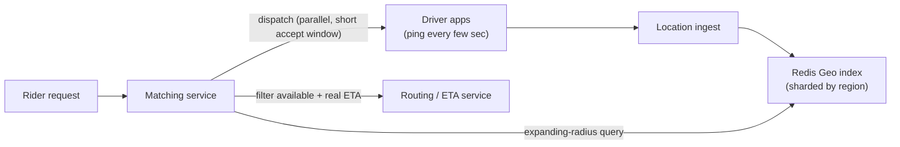

# SD-08 · Ride-Sharing App

> **Uber/Ola — geospatial indexing, real-time location updates, matching**  
> **Core challenge:** Continuously track millions of moving drivers and match riders to the nearest available one, in real time, without scanning every driver on every request.

*Reference solution (from the System Design Interview Playbook). For a timed mock, run `/study SD-8`; `/save-session` appends your own notes at the bottom.*

## Requirements & key numbers

- Drivers send location pings every few seconds — massive write volume
- A ride request must find nearby available drivers in well under a second
- Matching must account for availability, direction of travel and ETA — not just raw distance

## Architecture

## Deep dive

### Geospatial indexing

- **Geohashing** — encodes lat/long into a string where nearby locations share a prefix; 'find nearby drivers' becomes a prefix range query
- **Quadtree** — recursively divides the map, subdividing only where driver density is high — adapts to dense cities vs sparse rural areas

### Real-time location updates

- Updates are extremely high-volume but individually low-value and short-lived
- Strong candidate for an in-memory store (Redis geospatial commands) rather than a durable DB — losing a few seconds of stale location is harmless

### Matching algorithm

- Query the geo-index for drivers within an **expanding radius** (start small, widen if too few candidates)
- Filter by availability and estimate real **ETA** (not straight-line distance) using traffic/routing data
- Rank and dispatch — often to several drivers in parallel with a short acceptance window, to cut time-to-match

## Trade-offs & bottlenecks at scale

> **Bottom line:** At 10x scale the geospatial index must be sharded by region — a single node holding a whole city's driver locations becomes both a write bottleneck (constant pings) and a single point of failure.

## 30-second recall

| | |
|---|---|
| **Requirements twist** | Millions of drivers moving constantly; match in <1s without a full scan. |
| **Key design choice** | Geohash/quadtree index in an in-memory store; expanding-radius query; ETA-aware ranking. |
| **Main bottleneck (at 10x)** | Location write volume -> shard geo index by region. |
| **The trade-off they push on** | In-memory (fast, lossy) vs durable DB (safe, too slow for ping volume). |

## My notes (from study sessions)

_Nothing yet. Run `/study SD-8` for a mock round, then `/save-session`._
