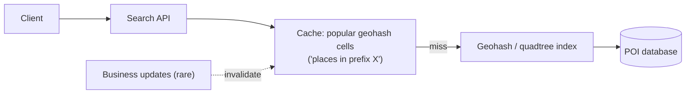

# SD-09 · Proximity / Location-Based Service

> **Yelp "restaurants near me" — geospatial queries at scale**  
> **Core challenge:** Answer 'what's near this point?' quickly across millions of largely static points of interest — a related but notably simpler problem than ride-sharing's constantly-moving drivers.

*Reference solution (from the System Design Interview Playbook). For a timed mock, run `/study SD-9`; `/save-session` appends your own notes at the bottom.*

## Requirements & key numbers

- Points of interest are mostly static (a restaurant doesn't move)
- Query pattern: given lat/long + radius, return nearby places ranked by distance/relevance
- High read volume, very low write volume — a classic caching opportunity

## Architecture

## Deep dive

### Why this differs from ride-sharing

- POIs rarely move, so the geospatial index can be far more static and heavily cached
- No need for the constant high-frequency write path that driver tracking requires

### Index choice

- **Geohash-based index** works well and is simpler to reason about when data density is relatively uniform
- **Quadtree** adapts cell size automatically for highly uneven density (dense city centre vs sparse suburbs)

### Caching strategy

- Cache popular geohash cells directly ('restaurants in geohash prefix X') — a very cacheable query shape
- Writes are rare, so cache invalidation is simple — a moderate TTL or explicit invalidation on business updates is enough

## Trade-offs & bottlenecks at scale

> **Bottom line:** The main interview signal is recognising that a near-identical geospatial technique serves two very different problems — the real distinction to articulate is write frequency (static POIs vs moving drivers), which changes the caching and consistency story entirely.

## 30-second recall

| | |
|---|---|
| **Requirements twist** | Same geo-indexing as Uber, but points are static and reads dominate. |
| **Key design choice** | Geohash index + aggressive caching of popular cells; simple TTL invalidation. |
| **Main bottleneck (at 10x)** | Read volume on hot areas -> cache hot geohash prefixes. |
| **The trade-off they push on** | Geohash simplicity vs quadtree density-adaptation. |

## My notes (from study sessions)

_Nothing yet. Run `/study SD-9` for a mock round, then `/save-session`._
