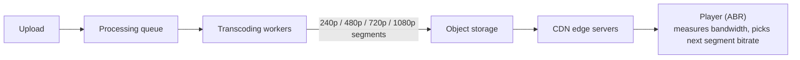

# SD-10 · Live Video Streaming / Video Platform

> **YouTube/Netflix — encoding pipeline, CDN distribution, adaptive bitrate**  
> **Core challenge:** Transform an uploaded video into multiple quality levels, then deliver it to viewers worldwide with minimal buffering, adapting in real time to each viewer's network.

*Reference solution (from the System Design Interview Playbook). For a timed mock, run `/study SD-10`; `/save-session` appends your own notes at the bottom.*

## Requirements & key numbers

- Uploads are large and infrequent relative to views (extremely read-heavy)
- Viewers have wildly different network conditions and devices
- Global audience — latency to origin storage would be unacceptable without help

## Architecture

## Deep dive

### Encoding pipeline

- Inherently async: video is uploaded, queued, transcoded by a worker pool into multiple resolutions/bitrates before it's watchable
- The upload response doesn't block on this slow, CPU-heavy step

### CDN distribution

- Encoded segments are pushed to CDN edge servers close to viewers, not served from origin for every view
- Single biggest lever for global latency — most requests never reach the origin once a video is popular

### Adaptive bitrate streaming (ABR)

- Video split into short segments (a few seconds), each available at every encoded bitrate
- The player continuously measures network speed and requests the next segment at whichever bitrate fits — dropping to 480p on degradation without a hard stop
- This is why streaming rarely fully stalls — quality adapts instead of halting

## Trade-offs & bottlenecks at scale

> **Bottom line:** The encoding pipeline is where cost and latency trade off most visibly — more bitrate variants means more storage/processing cost but better experience across device/network conditions; most platforms encode a handful of tiers, not a continuous range.

## 30-second recall

| | |
|---|---|
| **Requirements twist** | One upload -> many renditions -> a global, network-variable audience. |
| **Key design choice** | Async transcoding pipeline + CDN edge delivery + segmented ABR. |
| **Main bottleneck (at 10x)** | Encoding cost/time; origin bandwidth without CDN. |
| **The trade-off they push on** | Number of bitrate tiers: cost/storage vs viewer experience coverage. |

## My notes (from study sessions)

_Nothing yet. Run `/study SD-10` for a mock round, then `/save-session`._
