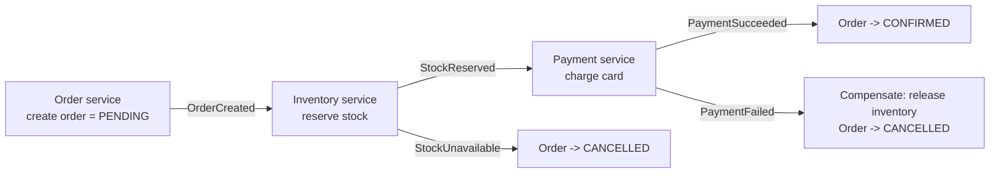

# SD-11 · E-Commerce Checkout / Order System

> **distributed transactions, inventory consistency, the Saga pattern**  
> **Core challenge:** An order touches multiple independently-owned services (inventory, payment, shipping) that each have their own database — a single ACID transaction across all of them isn't possible.

*Reference solution (from the System Design Interview Playbook). For a timed mock, run `/study SD-11`; `/save-session` appends your own notes at the bottom.*

## Requirements & key numbers

- Order, inventory and payment are separate services with separate databases (database-per-service)
- Must never oversell inventory (two customers buying the last item)
- Must never charge a customer without confirming the order, or vice versa

## Architecture

## Deep dive

### Why a normal transaction doesn't work

- A standard ACID transaction needs all participants to share one DB / transaction coordinator
- Once Order, Inventory and Payment each own a separate DB, you can't wrap one BEGIN/COMMIT around all three

### The Saga pattern

- Replace one big transaction with a sequence of local transactions, each publishing an event that triggers the next step
- If a later step fails, **compensating actions** undo the completed earlier steps (e.g. 'release reserved inventory' if payment fails) rather than a true rollback
- Sequence: create order (PENDING) -> reserve stock -> charge card -> confirm; any failure -> cancel + compensate prior steps

### Preventing overselling

- Inventory reservation must be atomic at the DB level — conditional decrement: `UPDATE stock SET qty = qty - 1 WHERE qty > 0`
- Distributed-locking-adjacent — same family as ticket booking

## Trade-offs & bottlenecks at scale

> **Bottom line:** Sagas trade strict consistency for availability and service independence — the system is briefly in an intermediate state (order PENDING while payment processes) rather than atomically all-or-nothing: the AP-leaning choice from CAP applied to a real checkout flow.

## 30-second recall

| | |
|---|---|
| **Requirements twist** | One business transaction spans services that each own a separate DB. |
| **Key design choice** | Saga: chained local transactions + events + compensating actions. |
| **Main bottleneck (at 10x)** | Inventory contention on the last unit -> atomic conditional decrement. |
| **The trade-off they push on** | Eventual consistency + intermediate states vs impossible cross-service ACID. |

## My notes (from study sessions)

_Nothing yet. Run `/study SD-11` for a mock round, then `/save-session`._
