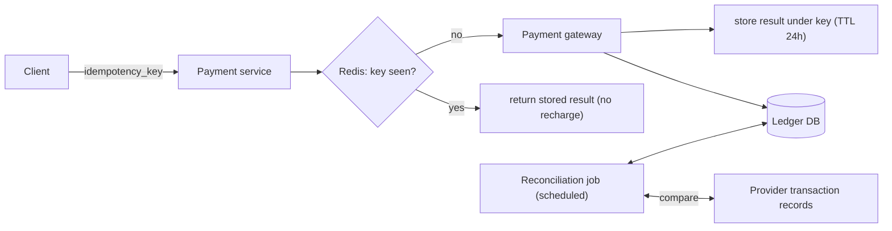

# SD-12 · Payment System

> **idempotency, the exactly-once illusion, reconciliation**  
> **Core challenge:** Money must never be double-charged or lost, even though the network between your system and the payment provider is inherently unreliable (timeouts, retries, dropped responses).

*Reference solution (from the System Design Interview Playbook). For a timed mock, run `/study SD-12`; `/save-session` appends your own notes at the bottom.*

## Requirements & key numbers

- Charging twice for one purchase is unacceptable — but so is failing to charge at all
- Network timeouts mean you often don't know if a charge actually succeeded on the provider's side
- Must reconcile your internal ledger against the provider's records periodically

## Architecture

## Deep dive

### The exactly-once illusion

- True exactly-once delivery doesn't exist over an unreliable network
- What you build is **at-least-once + idempotency**, which achieves the same practical guarantee: a retried request has no additional effect
- Store the result keyed by the idempotency key; on a repeat, return the stored result instead of recharging

### Reconciliation

- A scheduled job periodically compares your internal ledger against the provider's transaction records
- Catches edge cases idempotency can't — e.g. a charge that succeeded on the provider side but whose confirmation was lost before you recorded it
- The safety net that makes eventual correctness possible when a single request's outcome was genuinely ambiguous

## Trade-offs & bottlenecks at scale

> **Bottom line:** Idempotency keys and reconciliation are two different layers of defence, not redundant — idempotency prevents most double-charges at request time; reconciliation catches the rarer cases where the two systems' records genuinely diverged despite that.

## 30-second recall

| | |
|---|---|
| **Requirements twist** | You often can't tell whether a charge succeeded — the response was lost. |
| **Key design choice** | Idempotency key -> stored result; periodic ledger-vs-provider reconciliation. |
| **Main bottleneck (at 10x)** | Ambiguous request outcomes under network failure. |
| **The trade-off they push on** | At-least-once + idempotency (achievable) vs true exactly-once (impossible). |

## My notes (from study sessions)

_Nothing yet. Run `/study SD-12` for a mock round, then `/save-session`._
