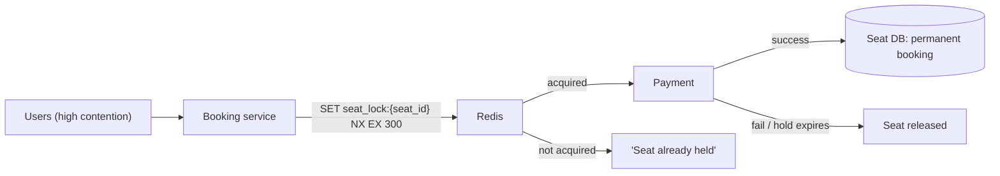

# SD-13 · Ticket Booking System

> **BookMyShow/Ticketmaster — concurrent booking of the same seat, race conditions, distributed locks**  
> **Core challenge:** Many users can attempt to book the exact same seat simultaneously — the system must guarantee only one succeeds, without double-booking or holding a lock so long it blocks other seats' unrelated bookings.

*Reference solution (from the System Design Interview Playbook). For a timed mock, run `/study SD-13`; `/save-session` appends your own notes at the bottom.*

## Requirements & key numbers

- High contention on popular events — thousands hitting 'buy' on the same show within seconds
- A seat must be held (not yet paid) briefly during checkout, then released if abandoned
- Must never double-book, but locking too broadly (whole show) kills throughput for unrelated seats

## Architecture

## Deep dive

### Distributed locking, scoped per seat

- The lock must be scoped to the **individual seat**, not the show or venue
- Locking anything broader serialises unrelated bookings that don't actually conflict, destroying throughput during high-demand on-sales
- `SET seat_lock:{seat_id} {user_id} NX EX {hold_seconds}` is atomic in Redis

### Why the lock needs a TTL

- If a user abandons checkout, the lock must expire automatically — otherwise that seat becomes permanently unbookable
- `EX=hold_seconds` (5-10 min) is that safety net — same 'never wait forever' principle as network timeouts

### Finalizing the booking

- Only once payment succeeds does the hold convert into a permanent booking in the seat DB
- If payment fails or the hold expires first, the seat becomes available again for the next user

## Trade-offs & bottlenecks at scale

> **Bottom line:** Fundamentally the same 'exactly one winner under contention' problem as the token bucket's atomic DECR — the fix is a Redis `SET NX EX` as a lightweight, self-expiring distributed lock, rather than a heavier system like ZooKeeper which would be overkill at this granularity.

## 30-second recall

| | |
|---|---|
| **Requirements twist** | Thousands of users, same seat, same second — exactly one must win. |
| **Key design choice** | Per-seat Redis `SET NX EX` lock with a TTL hold; convert to booking only on payment success. |
| **Main bottleneck (at 10x)** | Lock granularity — anything coarser than per-seat serialises unrelated bookings. |
| **The trade-off they push on** | Lightweight Redis lock (simple, TTL-safe) vs ZooKeeper/Raft (stronger, overkill here). |

## My notes (from study sessions)

_Nothing yet. Run `/study SD-13` for a mock round, then `/save-session`._
