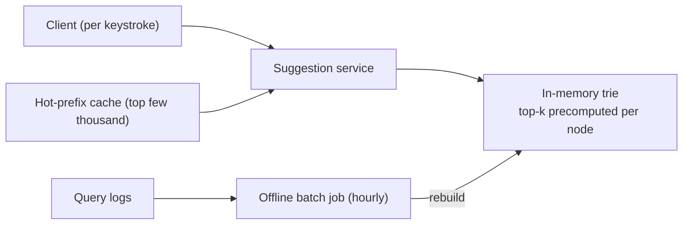

# SD-14 · Search Autocomplete / Typeahead

> **trie data structures, ranking by popularity, caching hot prefixes**  
> **Core challenge:** Return ranked suggestions for a partial query within milliseconds, as the user types character by character — far too fast for a database query per keystroke.

*Reference solution (from the System Design Interview Playbook). For a timed mock, run `/study SD-14`; `/save-session` appends your own notes at the bottom.*

## Requirements & key numbers

- Response time must feel instant — well under 100ms per keystroke
- Suggestions ranked by real-world popularity, not just alphabetically
- The underlying data (what's popular) changes gradually, not in real time

## Architecture

## Deep dive

### Trie data structure

- Stores strings character-by-character in a tree; every node represents a prefix
- Looking up all completions of 'pyth' = walk to that node and read its subtree — proportional to query length, not dataset size

### Ranking by popularity

- Each node/leaf stores a popularity score (historical search frequency)
- **Top-k results per node are precomputed and cached at the node** — a query returns pre-ranked suggestions instantly, no re-sorting per request

### Keeping the trie fresh without slowing reads

- Trie is rebuilt periodically (e.g. hourly) from aggregated query logs in an offline batch job — not updated on every search
- Trades a little staleness (new trends take up to an hour to appear) for a read path that never touches a DB

### Caching hot prefixes

- Query frequency follows a power law — a few thousand prefixes account for most traffic
- Caching just those prefixes' results captures the majority of query volume — a targeted caching decision, not a blanket one

## Trade-offs & bottlenecks at scale

> **Bottom line:** The whole design hinges on doing the expensive work (ranking, aggregation) offline and ahead of time, so the per-keystroke read path is just an in-memory tree traversal — trading write-side complexity for read-side speed.

## 30-second recall

| | |
|---|---|
| **Requirements twist** | A ranked query on every keystroke, in <100ms — no DB in the loop. |
| **Key design choice** | In-memory trie with precomputed top-k per node; hourly offline rebuild; hot-prefix cache. |
| **Main bottleneck (at 10x)** | Keeping the trie fresh without touching the read path. |
| **The trade-off they push on** | Staleness (hourly rebuild) vs read speed (no DB, no live updates). |

## My notes (from study sessions)

_Nothing yet. Run `/study SD-14` for a mock round, then `/save-session`._
