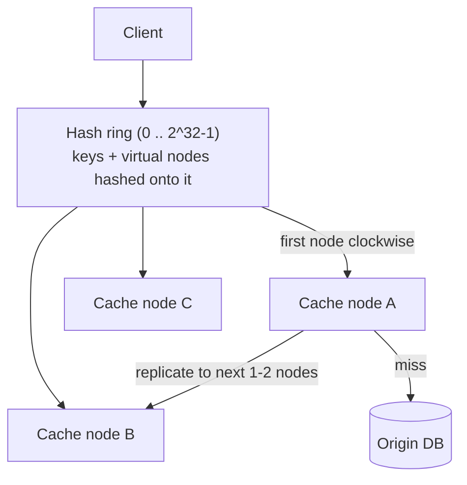

# SD-15 · Distributed Cache

> **build your own Redis-like system — consistent hashing, eviction, replication**  
> **Core challenge:** Spread cached data across many machines so no single node is a bottleneck, while making it possible to add or remove nodes without invalidating almost the entire cache.

*Reference solution (from the System Design Interview Playbook). For a timed mock, run `/study SD-15`; `/save-session` appends your own notes at the bottom.*

## Requirements & key numbers

- Cache must scale horizontally across many nodes as data volume grows
- Adding/removing a node should reshuffle only a small fraction of keys, not nearly all
- Node failure shouldn't lose data that other nodes could have served

## Architecture

## Deep dive

### Why simple hashing (key % num_nodes) fails

- Adding/removing even one node changes num_nodes, which changes `key % num_nodes` for almost every key
- Nearly the entire cache is invalidated at once -> a massive stampede to the origin DB

### Consistent hashing — the fix

- Both nodes and keys are hashed onto the same circular ring (0 to 2^32-1)
- A key is stored on the first node found walking clockwise from the key's position
- Adding/removing a node only affects keys between it and its neighbour — roughly 1/N of all keys

### Virtual nodes

- Each physical node is placed on the ring many times ('virtual nodes') to avoid the uneven load plain consistent hashing can still produce with few physical nodes

### Eviction & replication

- **LRU** default eviction per node
- Each key replicated to the next 1-2 nodes clockwise, so a single node failure doesn't lose data — reads fall back to a replica

## Trade-offs & bottlenecks at scale

> **Bottom line:** Consistent hashing is the single idea that makes a distributed cache operationally viable — without it, every scaling event would itself cause the exact stampede the cache exists to prevent.

## 30-second recall

| | |
|---|---|
| **Requirements twist** | Scaling the cache must not invalidate the cache. |
| **Key design choice** | Consistent hashing on a ring + virtual nodes + replicate to next 1-2 nodes. |
| **Main bottleneck (at 10x)** | Rehash storm on node add/remove (solved by the ring). |
| **The trade-off they push on** | Virtual-node count: load evenness vs metadata overhead. |

## My notes (from study sessions)

_Nothing yet. Run `/study SD-15` for a mock round, then `/save-session`._
