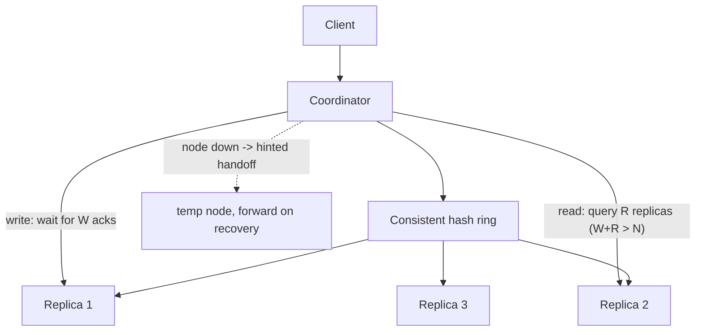

# SD-16 · Key-Value Store

> **like DynamoDB — partitioning, replication, consistency model choice**  
> **Core challenge:** Build a store that scales horizontally for both storage and throughput, stays available during node failures, and lets the caller choose a consistency/latency trade-off per operation.

*Reference solution (from the System Design Interview Playbook). For a timed mock, run `/study SD-16`; `/save-session` appends your own notes at the bottom.*

## Requirements & key numbers

- Simple access pattern: get(key), put(key, value) — no joins, no complex queries
- Must scale to far more data and throughput than one machine can hold
- Must stay available even when some nodes are down or partitioned

## Architecture

## Deep dive

### Partitioning

- Keys distributed across nodes using **consistent hashing** (same mechanism as the distributed cache)
- Each node owns a range of the hash ring and stores only the keys that fall into it

### Replication

- Each key replicated to N nodes (commonly N=3) for durability and read availability
- Writes need a **quorum** ack (e.g. W=2 of 3); reads query R replicas; choosing **W + R > N** guarantees any read quorum sees the latest write

### Tunable consistency — the DynamoDB insight

- **Strongly consistent read** — query a full quorum, guarantees the latest value, higher latency
- **Eventually consistent read** — query one replica, faster, may be slightly stale
- CAP exposed directly as a per-request API-level choice, not baked in globally

### Handling node failure

- If a node is unreachable during a write, store it temporarily elsewhere (**hinted handoff**) and forward on recovery
- Trades brief inconsistency for continued availability — an AP-leaning choice

## Trade-offs & bottlenecks at scale

> **Bottom line:** The defining insight: consistency isn't a single global setting — a well-designed key-value store lets the caller pick strong vs eventual consistency per request based on what that operation actually needs.

## 30-second recall

| | |
|---|---|
| **Requirements twist** | Caller wants to choose consistency vs latency per operation. |
| **Key design choice** | Consistent-hash partitioning + N replicas + quorum reads/writes (W+R>N) + hinted handoff. |
| **Main bottleneck (at 10x)** | Coordination cost of strong-consistency quorums. |
| **The trade-off they push on** | Strong read (full quorum, slow) vs eventual read (one replica, maybe stale). |

## My notes (from study sessions)

_Nothing yet. Run `/study SD-16` for a mock round, then `/save-session`._
