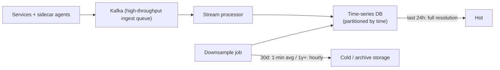

# SD-17 · Log / Metrics Aggregation System

> **high write throughput, time-series data, downsampling old data**  
> **Core challenge:** Ingest a massive, continuous stream of writes from every service in the fleet, while keeping recent data queryable in detail and old data cheap to retain.

*Reference solution (from the System Design Interview Playbook). For a timed mock, run `/study SD-17`; `/save-session` appends your own notes at the bottom.*

## Requirements & key numbers

- Extremely write-heavy — every service instance emits logs/metrics continuously
- Recent data needs fine-grained detail for debugging; old data is queried rarely and coarsely
- Storage cost grows unbounded if every data point is retained at full resolution forever

## Architecture

## Deep dive

### Ingestion pipeline

- A lightweight agent runs alongside each service (**sidecar**), forwarding to a high-throughput queue (Kafka) rather than writing directly to a DB
- Decouples the write-heavy ingestion rate from the storage layer's actual write capacity

### Time-series database

- Optimised for append-heavy writes and time-range queries ('last hour'), unlike a general-purpose relational DB
- Data naturally partitioned by time — old partitions can be moved to cheaper storage wholesale

### Downsampling

- Last 24h: full resolution — every data point kept
- Last 30 days: downsampled to 1-minute averages
- 1 year+: hourly, or moved to cold/archive storage entirely
- Mirrors the LRU intuition — recent detailed data is queried often; old data rarely and only coarsely

## Trade-offs & bottlenecks at scale

> **Bottom line:** The whole architecture is shaped by one observation: write volume is enormous but the value of any single data point decays fast with age — downsampling is what keeps storage cost bounded while ingestion keeps flowing.

## 30-second recall

| | |
|---|---|
| **Requirements twist** | Firehose of writes; recent data valuable, old data nearly worthless. |
| **Key design choice** | Sidecar -> Kafka -> stream processor -> time-series DB; tiered downsampling by age. |
| **Main bottleneck (at 10x)** | Write throughput -> decouple ingest with a queue. |
| **The trade-off they push on** | Retention resolution vs storage cost (downsample old data). |

## My notes (from study sessions)

_Nothing yet. Run `/study SD-17` for a mock round, then `/save-session`._
