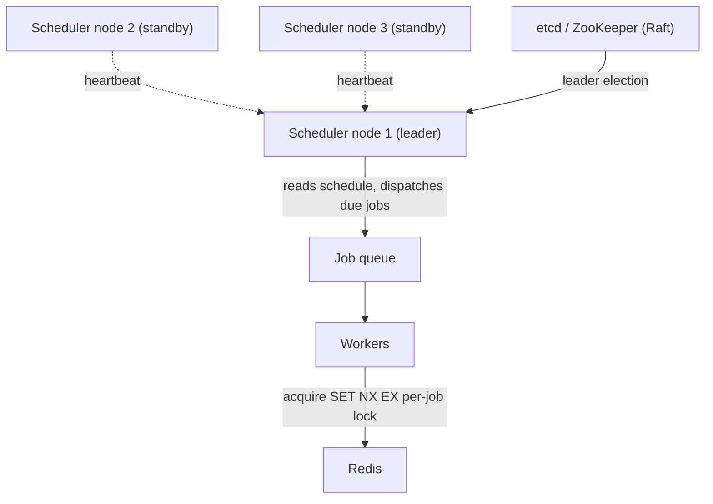

# SD-18 · Distributed Job Scheduler

> **like Cron at scale — leader election, avoiding duplicate job execution across nodes**  
> **Core challenge:** Run scheduled jobs reliably across a cluster without either missing a scheduled run or accidentally running the same job twice because two nodes both thought they were responsible.

*Reference solution (from the System Design Interview Playbook). For a timed mock, run `/study SD-18`; `/save-session` appends your own notes at the bottom.*

## Requirements & key numbers

- Jobs must run on schedule even if the scheduling node crashes
- A job must never run twice concurrently just because multiple scheduler instances are up for redundancy
- Must scale to a large number of distinct scheduled jobs across many worker machines

## Architecture

## Deep dive

### Leader election

- Multiple scheduler nodes run for redundancy, but only ONE is the active leader that dispatches jobs; the rest are standbys
- Typically implemented via **Raft** or a coordination service (ZooKeeper/etcd)

### Avoiding duplicate execution

- Only the elected leader reads the schedule and pushes due jobs onto the queue — standbys don't dispatch while a healthy leader exists
- Extra safety net: each job acquires a short-lived distributed lock (`SET NX EX`) before a worker executes it — even if two dispatches happened, only one worker wins the lock

### Handling leader failure

- Standbys send heartbeats to detect a dead leader; on failure a new leader is elected and takes over
- Some jobs may be dispatched a few seconds late during handoff — acceptable trade-off for correctness (no duplicate runs) over perfect timing

## Trade-offs & bottlenecks at scale

> **Bottom line:** The job-locking safety net matters because leader election alone isn't airtight during network partitions — a 'brief dual-leader' window is possible, so the per-job lock is what actually guarantees exactly-once execution, not the election mechanism by itself.

## 30-second recall

| | |
|---|---|
| **Requirements twist** | Redundant schedulers must not double-run a job, must not miss one. |
| **Key design choice** | Leader election (Raft/etcd) for dispatch + per-job `SET NX EX` lock as backstop. |
| **Main bottleneck (at 10x)** | Dual-leader window during partitions. |
| **The trade-off they push on** | Slightly late dispatch on failover vs risk of duplicate execution. |

## My notes (from study sessions)

_Nothing yet. Run `/study SD-18` for a mock round, then `/save-session`._
