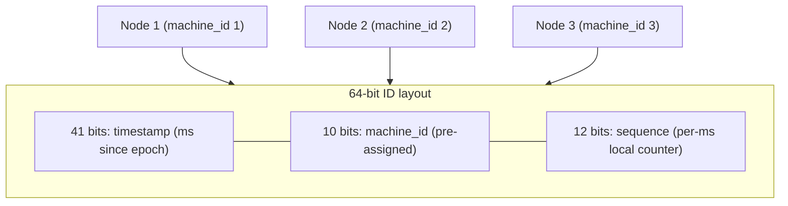

# SD-19 · ID Generator (Twitter Snowflake)

> **unique IDs across distributed systems without a central bottleneck**  
> **Core challenge:** Generate globally unique, roughly time-sortable IDs across many independent nodes simultaneously, without any node coordinating with a central counter for every ID.

*Reference solution (from the System Design Interview Playbook). For a timed mock, run `/study SD-19`; `/save-session` appends your own notes at the bottom.*

## Requirements & key numbers

- Must generate unique IDs at very high throughput across many nodes
- IDs should be roughly sortable by creation time (useful for pagination, debugging)
- No single point of coordination allowed

## Architecture

## Deep dive

### The Snowflake structure

- Each ID is a single 64-bit integer from three concatenated parts
- `[41 bits timestamp][10 bits machine_id][12 bits sequence]`
- timestamp -> roughly time-sortable; machine_id -> statically assigned per node, guarantees no cross-node collision; sequence -> local counter reset every ms, up to 4096 IDs/node/ms with zero coordination

### Why no central bottleneck

- Each node generates its own IDs from its own clock + machine_id — no network call, no shared counter, no lock
- Two nodes can never produce the same ID because their machine_id segment differs even if timestamp and sequence match

### The one real constraint

- Clock synchronisation matters — if a node's clock jumps backward (NTP correction) it could generate a duplicate or out-of-order ID
- Production implementations detect backward jumps and briefly pause ID generation on that node rather than risk a collision

## Trade-offs & bottlenecks at scale

> **Bottom line:** The cleanest illustration of a recurring theme: push coordination out of the hot path entirely by pre-assigning what would otherwise need a lock (here, machine_id) — the same principle as the URL shortener's pre-generated key pool.

## 30-second recall

| | |
|---|---|
| **Requirements twist** | Unique + roughly-sortable IDs at high throughput with zero coordination. |
| **Key design choice** | Snowflake: timestamp | pre-assigned machine_id | per-ms sequence, all in 64 bits. |
| **Main bottleneck (at 10x)** | Clock skew / backward jumps. |
| **The trade-off they push on** | Rough time-ordering + no coordination vs strict monotonicity. |

## My notes (from study sessions)

_Nothing yet. Run `/study SD-19` for a mock round, then `/save-session`._
