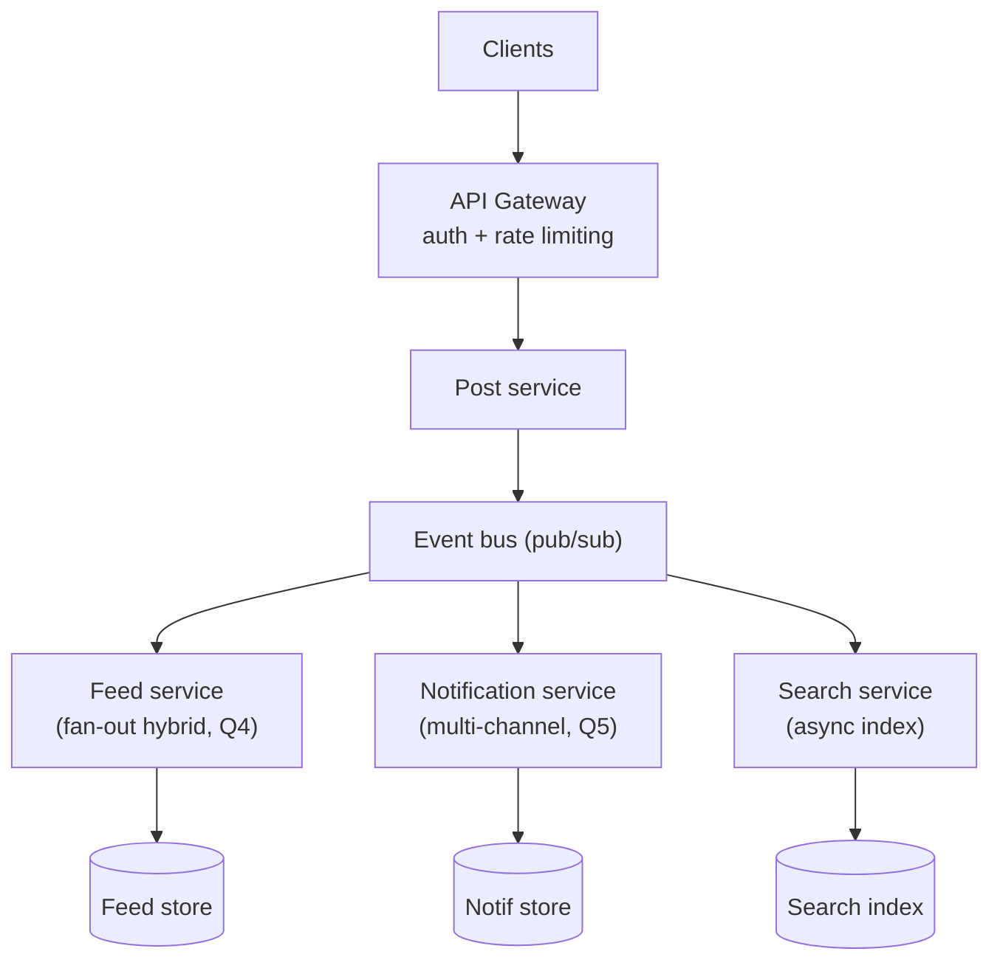

# SD-20 · Full Platform Capstone (Twitter/Reddit-style)

> **feed + search + notifications + rate limiting, combined into one system**  
> **Core challenge:** This question deliberately has no single 'deep dive' — it tests whether you can assemble everything from the other 19 questions into one coherent architecture and reason about how the pieces interact.

*Reference solution (from the System Design Interview Playbook). For a timed mock, run `/study SD-20`; `/save-session` appends your own notes at the bottom.*

## Requirements & key numbers

- Users post, follow each other, search content, and receive notifications — all in one platform
- Must handle read-heavy (feed, search) and write-sensitive (posting, notifications) workloads simultaneously
- Individual subsystems must fail independently — a search outage shouldn't take down posting

## Architecture

## Deep dive

### How the pieces assemble

- **API Gateway** — single entry point, handles auth and rate limiting (Q2) before anything reaches a service
- **Post Service** — writes the post, then publishes an event rather than calling every downstream system directly
- **Feed Service** — subscribes to post events, applies the fan-out hybrid from Q4
- **Notification Service** — subscribes to the same stream, fans out across channels as in Q5
- **Search Service** — subscribes and indexes new posts asynchronously; a few seconds stale is acceptable for not blocking the post path

### Why the event bus is the key design decision

- Without it, Post Service would synchronously call Feed, Notification and Search on every post — coupling their uptime and latency, and making it impossible to add a new consumer (e.g. analytics) without modifying Post Service
- The event bus is what lets every subsystem fail independently

### What an interviewer is actually grading

- Not whether you rebuild Twitter exactly — whether you recognise which of the previous 19 patterns applies to which piece, in real time
- Whether you identify the event bus (pub/sub) as the decision that makes everything else independently scalable and failable

## Trade-offs & bottlenecks at scale

> **Bottom line:** A capstone is really asking 'can you compose the smaller answers you already know into one system, live, without being told which piece goes where' — the event-driven backbone connecting Post/Feed/Notification/Search is the one idea worth stating explicitly and early.

## 30-second recall

| | |
|---|---|
| **Requirements twist** | No single deep-dive — compose 19 patterns into one coherent system live. |
| **Key design choice** | Event bus behind the Post service; every subsystem is an independent async consumer. |
| **Main bottleneck (at 10x)** | Synchronous coupling between subsystems (avoided by the bus). |
| **The trade-off they push on** | Async indexing/notification staleness vs blocking the post path. |

## My notes (from study sessions)

_Nothing yet. Run `/study SD-20` for a mock round, then `/save-session`._
